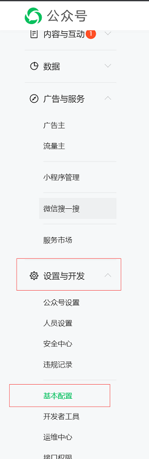
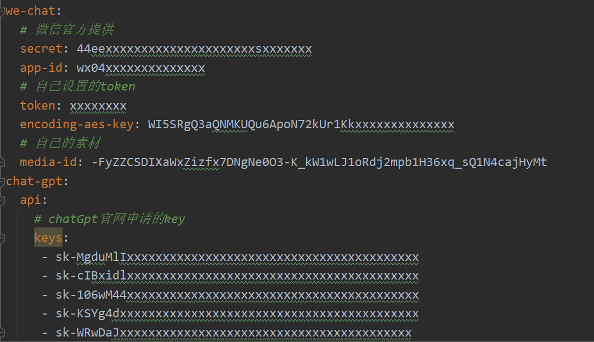

# Read Me First
  * The JVM level was changed from '1.8'
  * 只需要自己走一些公众号、chatGPT、服务器申请流程，通过配置，开箱即用
  * 原理是用户向公众号发送一条消息，这条消息首先到腾讯的服务器上，
  腾讯会将消息再转发到你的机器上，你就能够通过转发过来的消息进行，
  一些逻辑处理
  * token值动态计算，自动组合用户聊天上下文
  * 天气预报/天气预警推送功能

# Getting Started

* 需要一台有公网的服务器，不然腾讯消息没地方转，或者
  使用 https://natapp.cn 进行内网穿透，最好申请一台在国外的服务器，
  厂商挺多的，国内还都很贵

1、首先去微信申请一个公众号，或者测试号

申请地址：https://mp.weixin.qq.com/

申请之后需要在公众号的基本配置中进行一些配置

无脑配就行，主要是服务器地址填http://你的域名/v1/gpt/wechat/event

域名可以填natapp生成的域名

2、还需要申请ChatGPT的key

申请地址：https://platform.openai.com/account/api-keys

接着将申请到的微信配置信息以及ChatGPT的key填入到application.yaml当中，启动即可

